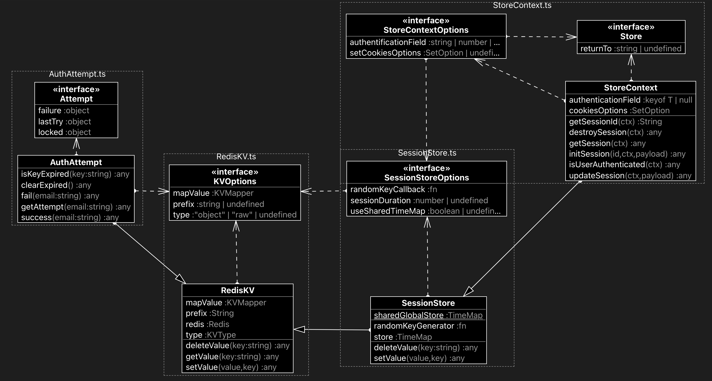

# Redis
MyUnisoft Redis package.

## Requirements

- [Node.js](https://nodejs.org/en/) version 14 or higher.
- Docker (for running tests).

> If you ever want to setup a local instance of Redis, please follow [this guide](./docs/Installation.md).

## Getting Started

This package is available in the Node Package Repository and can be easily installed with [npm](https://docs.npmjs.com/getting-started/what-is-npm) or [yarn](https://yarnpkg.com).

```bash
$ npm i @myunisoft/redis
# or
$ yarn add @myunisoft/redis
```

All of the following APIs can be used as follow:

## Usage example

By default the package already export methods to instantiate and close connection to Redis. All features of the package automatically re-use current active Redis connection.

```js
import assert from "assert";
import { initRedis, getRedis, closeRedis } from "@myunisoft/redis";

const redisConn = initRedis();

try {
  // do the work here!

  // getRedis() allow to retrieve the current connection anywhere in the code
  assert.strictEqual(redisConn, getRedis());
}
finally {
  closeRedis();
}
```

The package exports a class that will allow you to perform create, update, get and delete operations without any difficulty (on raw or object values).

```ts
import { RedisKV } from "@myunisoft/redis";

interface MyCustomObject {
  foo: string;
  life: number;
  isReal: boolean;
}

const customKvWrapper = new RedisKV<MyCustomObject>({
  type: "object"
});

await customKvWrapper.setValue({ foo: "bar", life: 10, isReal: true }, "mykey");

const obj = await customKvWrapper.getValue("mykey");
console.log(obj);
```

## API



- [RedisKV class](./docs/RedisKV.md)
- [SessionStore class](./docs/SessionStore.md)
- [StoreContext class](./docs/StoreContext.md)
- [AuthAttempt class](./docs/AuthAttempt.md)

### Redis Stream

- [Basement class](./docs/stream/Basement.md)
- [Intrapersonal class](./docs/stream/Intrapersonal.md)
- [GroupConsumer class](./docs/stream/interpersonal/GroupConsumer.md)
